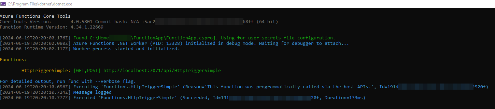

# Simple http with dotnet-isolated mode

Sample from official docs

- https://learn.microsoft.com/en-us/azure/azure-functions/dotnet-isolated-process-guide?tabs=windows

- https://github.com/Azure/azure-functions-dotnet-worker/tree/main/samples/FunctionApp

## Demo

Just run it and execute:

```
curl http://localhost:7071/api/HttpTriggerSimple
```

## Localhost

It works with visual studio 2022 and windows 10




## Azure deploy

In progress