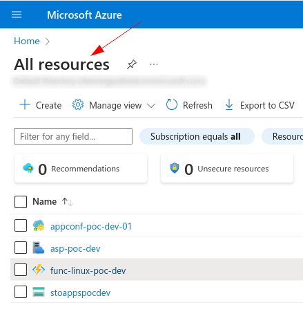
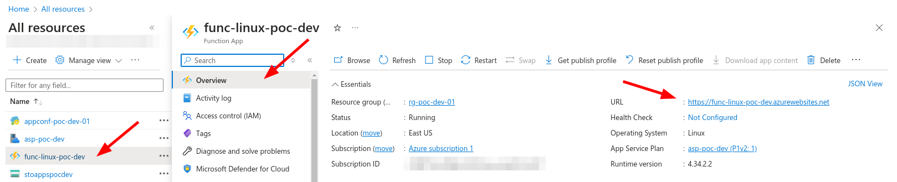
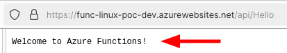

# Hello World

## Automated way with docker

### Requirements

- docker
- azure account

### Steps

```
docker run -it -v $(pwd):/sandbox zenika/terraform-azure-cli

az login

cd /sandbox

cd terraform

terraform init

terraform plan

terraform apply
```

If no errors you will see these in your azure web console



The public url of your function should be: https://func-linux-poc-dev.azurewebsites.net



Then if you perform a get request (with curl or a web browser) to this url `https://func-linux-poc-dev.azurewebsites.net/api/Hello` you will get this as response:



### :warning: Destroy :warning:

```
terraform apply -destroy
```